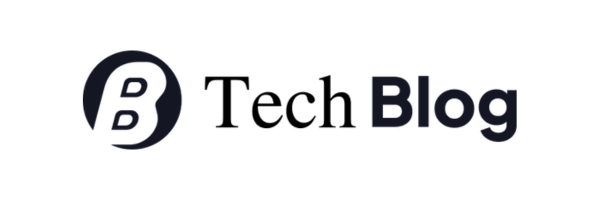
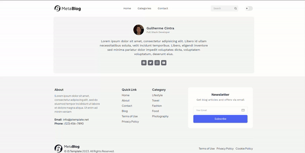

# English version 🇱🇷 - [(Go to Brazilian version 🇧🇷)](https://github.com/GuiCintra27/Track-it/blob/main/readme-portuguese.md)

<div style="text-align: center;">
  
  <br/>
  <br/>
  <a href="https://tech-blog-cintra.vercel.app/"><strong>Deploy Link »</strong></a>
  <br/>
  <br/>
</div>
<div align="center">
  <a href="https://www.figma.com/file/esJ75DiHt6C0JPaV5ufdSJ/Tech-Blog?type=design&mode=design&t=i8306vKEQjkKnRTe-1">Figma</a> •
  <a href="#about">About</a> •
  <a href="#technologies">Technologies</a> •
  <a href="#run">How to run?</a> •
  <a href="#links">Links</a> 
</div>

### Home

  

### Post Page

  

### Contact Page

  

## <span id="about">🌐 About the project</span>

Its main objective is to deepen knowledge of rendering methods, which can be used in Next.js, to improve user experience and SEO methods, in addition to reducing page loading time and allowing actions even if the user has a slow connection.

A skeleton loading is displayed to reduce the perception of a long loading time, and local storage is used to save the user's theme choice.

The CMS used was Hygraph, it has a good response speed and can be used free of charge. In addition to having very intuitive navigation, its API communicates using the GraphQL protocol, which was one of the objectives of this project.

Communication with the server was done with Apollo Client using GraphQL. The communication hooks with the server were generated automatically, using GraphQL Codegen. It analyzes the produced GraphQL queries, checks whether the format is compatible with the API, and then outputs the code in a designated folder.

Several unit tests were generated, covering topics such as: rerender, firing events, custom render function, data mock, faker for generating false data.

Below is a list of some of the implemented features:

- Hygraph as CMS for creating and managing GraphQL API content
- Apollo Client for GraphQL communication with the API
- GraphQL Codegen for automatic code generation from GraphQL queries
- Redux for sharing data between components
- Changing the theme from the Theme Provider (Styled-Components)
- Skeleton Loading as loading animation
- Local Storage for data persistence
- Testing using the React Testing Library, Jest and Faker
- Design Patterns
- Arquitechture Patterns

## <span id="technologies">🛠 Technologies</span>

The following tools and frameworks were used in the construction of the project: <br/>

<div style="display: inline_block"> 
  
  
  
  
  
  
    
  
    
  
</div>

## <span id="run">⚙️ How to run</span>

1. Clone this repository
2. Add the HYGRAPH API URL to the environment variables (example in the .env.example file)
3. Install dependencies

```bash
npm i
```

4. Run the application with

```bash
npm run dev
```

5. You can optionally build the project with

```bash
npm run build
```

6. And run the production version

```bash
npm start
```

7. Finally, access http://localhost:3000 in your browser to view the application


### 🧪 Tests

To run the tests, execute the command

```bash
npm test
```

## <span id="links">🚀 Links</span>

- [Deploy](https://tech-blog-cintra.vercel.app/)
- [Figma](https://www.figma.com/file/esJ75DiHt6C0JPaV5ufdSJ/Tech-Blog?type=design&mode=design&t=i8306vKEQjkKnRTe-1)